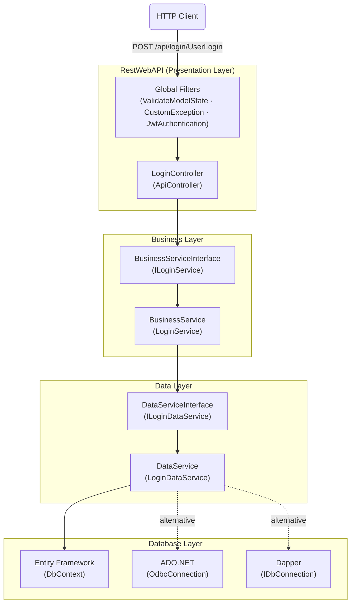

# Enterprise Employee Directory API


A production-style ASP.NET Web API that exposes an internal corporate employee directory.

---

## Architecture Overview

A single HTTP request flows through seven distinct layers. Each layer communicates only with the one directly below it, via an interface contract.



### Request Lifecycle

1. Request hits the **global filters** — model state validated, exceptions caught before the controller runs
2. `LoginController` receives the request; depends only on `ILoginService` (never on concrete implementations)
3. `LoginService` maps the business request to a data request and calls `ILoginDataService`
4. `LoginDataService` executes the query via one of three ORM strategies (EF, Dapper, or ADO.NET)
5. Results flow back up through static mapper methods (`EmployeeListBOResponse.Create()`) at each layer boundary
6. Controller wraps the result in a uniform `BOResponse<T>` and returns it to the client

---

## Features

| Feature | Implementation | Location |
|---------|---------------|----------|
| JWT Authentication | Custom `AuthorizationFilterAttribute` with HMAC-SHA256 | `Filters/JwtAuthenticationAttribute.cs` |
| Request Validation | FluentValidation + DataAnnotations (dual strategy) | `BusinessModel/LoginBORequest.cs` |
| Entity Framework ORM | `DbContext.Database.SqlQuery<T>` via `DbService` | `Database/Context.cs`, `DataService/DbService.cs` |
| ADO.NET | `OdbcConnection` / `DbProviderFactory` pattern | `Database/Context.cs` (`Ado` static class) |
| Dapper | `IDbConnection.Query<T>` | `Database/Context.cs` (`DapperClass`), `DataService/LoginDataService.cs` |
| Dependency Injection | Ninject — bindings wired at startup | `RestWebAPI/App_Start/NinjectWebCommon.cs` |
| Swagger / OpenAPI | Swashbuckle with XML doc comments | `RestWebAPI/App_Start/SwaggerConfig.cs` |
| Global Exception Handling | `ExceptionFilterAttribute` — returns HTTP 500 with sanitized message | `Filters/CustomExceptionFilter.cs` |
| Global Model Validation | `ActionFilterAttribute` — returns HTTP 400 on invalid model | `Filters/ValidateModelStateFilter.cs` |
| Convention + Attribute Routing | Both strategies registered | `App_Start/WebApiConfig.cs`, `App_Start/RouteConfig.cs` |

---

## API Endpoints

### Authentication

**POST** `/api/login/UserLogin`

Authenticates a user and returns a signed JWT.

```json
// Request body
{
  "username": "jdoe",
  "password": "secret",
  "udId": "device-uuid"
}

// Response 200 OK
"eyJhbGciOiJIUzI1NiIsInR5cCI6IkpXVCJ9..."

// Response 400 Bad Request (FluentValidation)
{ "message": "UserName cannot be empty" }

// Response 404 Not Found (user not in system)
```

---

### Employee Directory

**GET** `/api/login/GetEmployeeList?userId={id}`

Returns the employee list for the given user context. **Requires Bearer token.**

```
Authorization: Bearer <token>
```

```json
// Response 200 OK
{
  "Code": 0,
  "Desc": "",
  "Data": [
    { "fName": "Joseph", "lName": "Chirshian", "department": "Engineering", "email": "..." },
    ...
  ]
}

// Response 401 Unauthorized (missing or invalid token)
{ "Code": -3, "Desc": "Missing Jwt Token" }
```

---

### Scaffolded CRUD (Values)

**GET** `/api/values` — returns placeholder values  
**GET** `/api/values/{id}`  
**POST / PUT / DELETE** `/api/values/{id}`

---

## Architecture Decisions

These decisions are the ones interviewers tend to ask about. The short answer for each is *why this choice* rather than *what it does*.

### N-Tier Separation (7 Projects)

Splitting into separate assemblies (`BusinessService`, `DataService`, etc.) enforces compile-time boundaries — `RestWebAPI` physically cannot call `LoginDataService` directly, because it has no project reference to it. This is a stronger guarantee than naming conventions or code review. It also means each layer is independently deployable and independently testable.

### Interface at Every Layer

`ILoginService` and `ILoginDataService` exist for two reasons:

1. **Ninject can swap implementations** without the calling code changing — the `LoginController` constructor receives `ILoginService` and has no idea whether the runtime instance is `LoginService`, a test stub, or a future `CachedLoginService`.
2. **Unit tests can mock the seam** — `LoginServiceTests` mocks `ILoginDataService` with Moq, so the business logic is tested in complete isolation from the database driver.

### Static Mapper Methods (`Create()`)

Each model type owns its own mapping logic as a static factory method — `LoginBORequest.Create(boRequest)` returns a `LoginRequest`, `EmployeeListBOResponse.Create(list)` returns a `BOResponse<EmployeeListBOResponse>`. This is deliberately different from AutoMapper: the mapping is explicit, compile-time checked, and colocated with the type it produces. No magic, no configuration file.

### Generic `BOResponse<T>` / `BOResponseSingle<T>`

A uniform envelope for all API responses. Every endpoint returns the same shape — `Code`, `Desc`, `Data`. Clients always know where to look; error handling is consistent across all endpoints; adding a new field to the envelope propagates automatically to every response.

### Global Filters (Not Per-Controller)

`ValidateModelStateFilter` and `CustomExceptionFilter` are registered globally in `WebApiConfig.cs`, not applied per-controller. This guarantees that **no endpoint can be added to the project without getting validation and exception handling for free**. A per-controller attribute is easily forgotten; a global registration is not.

### JWT with `ClockSkew = TimeSpan.Zero`

The default `ClockSkew` in `System.IdentityModel.Tokens.Jwt` is 5 minutes — meaning a 2-minute token actually lives for 7 minutes. Setting it to `TimeSpan.Zero` makes the expiry time exact. This matters for short-lived tokens (the `UserLogin` endpoint issues a 2-minute token) and shows an understanding of token validation internals rather than accepting framework defaults blindly.

### Three ORM Strategies Under One Interface

The three implementations (Entity Framework, Dapper, ADO.NET) are all wired to the same `ILoginDataService` contract. You can swap the ORM used for any query by changing a single Ninject binding in `NinjectWebCommon.cs` — the business layer and API layer are completely unaware of the change. See [docs/ORM_COMPARISON.md](docs/ORM_COMPARISON.md) for when to choose each.

---

## Project Structure

```
RESTWebAPI.sln
│
├── RestWebAPI/                     # Presentation layer — controllers, filters, startup
│   ├── Controllers/
│   │   ├── LoginController.cs      # Auth + employee endpoints
│   │   ├── TokenController.cs      # JWT generation and validation
│   │   └── ValuesController.cs     # Scaffolded CRUD placeholder
│   ├── Filters/
│   │   ├── JwtAuthenticationAttribute.cs   # Bearer token validation
│   │   ├── CustomExceptionFilter.cs        # Global HTTP 500 handler
│   │   └── ValidateModelStateFilter.cs     # Global HTTP 400 handler
│   └── App_Start/
│       ├── WebApiConfig.cs         # Routes, global filters, FluentValidation registration
│       ├── NinjectWebCommon.cs     # DI container — interface→implementation bindings
│       └── SwaggerConfig.cs        # Swashbuckle / OpenAPI configuration
│
├── BusinessServiceInterface/       # Contracts the presentation layer depends on
│   └── ILoginService.cs
│
├── BusinessService/                # Business logic — orchestrates data calls, applies rules
│   └── LoginService.cs
│
├── BusinessModel/                  # Request/response models for the business layer
│   ├── BOResponse.cs               # Generic list envelope
│   ├── BOResponseSingle.cs         # Generic single-item envelope
│   ├── LoginBORequest.cs           # Includes FluentValidation LoginValidator
│   ├── UserLoginInfoBOResponse.cs
│   └── EmployeeListBOResponse.cs   # Includes static mapper + BOResponse factory
│
├── DataServiceInterface/           # Contracts the business layer depends on
│   └── ILoginDataService.cs
│
├── DataService/                    # Data access — EF / Dapper / ADO.NET implementations
│   ├── LoginDataService.cs         # Three ORM strategies (EF active; Dapper/ADO commented)
│   └── DbService.cs                # EF query wrapper
│
├── DataModel/                      # POCO models that match database schema
│   ├── EmployeeMaster.cs
│   ├── LoginRequest.cs
│   └── UserLoginInfoResponse.cs
│
├── Database/                       # Database infrastructure
│   └── Context.cs                  # EF DbContext + ADO.NET Ado class + Dapper DapperClass
│
└── RestWebAPI.Tests/               # Unit tests — NUnit 3 + Moq
    └── LoginServiceTests.cs
```

---

## How to Run Locally

### Prerequisites

- Visual Studio 2019 or later (with .NET Framework 4.6.1 workload)
- Windows (IIS Express required for `System.Web` hosting)

### Steps

1. **Clone the repo**
   ```bash
   git clone https://github.com/shwetaptl/RESTWebAPI.git
   cd RESTWebAPI
   ```

2. **Open the solution**
   ```
   Open RestWebAPI.sln in Visual Studio
   ```

3. **Restore NuGet packages**
   ```
   Tools → NuGet Package Manager → Restore
   ```
   *(The `packages/` folder is excluded from source control — NuGet restores it on build.)*

4. **Configure database (optional)**
   The data layer currently returns **static mock data** — the API runs and returns responses without a database connection. To connect a real database, update `Web.config`:
   ```xml
   <connectionStrings>
     <add name="Entities" connectionString="your-connection-string" providerName="..." />
   </connectionStrings>
   <appSettings>
     <add key="DataProvider" value="System.Data.Odbc" />
   </appSettings>
   ```
   Then uncomment the relevant query block in `DataService/LoginDataService.cs`.

5. **Run**
   Press `F5` or set `RestWebAPI` as startup project and run.

6. **Swagger UI**
   ```
   http://localhost:{port}/swagger
   ```

### Test the API (with static mock data)

```bash
# 1. Authenticate — returns a JWT
curl -X POST http://localhost:{port}/api/login/UserLogin \
  -H "Content-Type: application/json" \
  -d '{"username":"jdoe","password":"secret","udId":"device-1"}'

# 2. Use the token to fetch the employee list
curl http://localhost:{port}/api/login/GetEmployeeList?userId=1 \
  -H "Authorization: Bearer <token-from-step-1>"
```

---

## .NET Framework 4.6.1 vs .NET 8

This project targets **.NET Framework 4.6.1**, which was the enterprise standard at the time of writing. The architecture patterns used here are fully applicable to modern .NET; the migration changes are surface-level framework API differences, not design changes:

| Concept | .NET Framework 4.6.1 | .NET 8 Equivalent |
|---------|---------------------|-------------------|
| Hosting | `Global.asax`, `WebApiConfig` | `WebApplication.CreateBuilder()` minimal API or controller app |
| Dependency Injection | Ninject (`NinjectWebCommon.cs`) | Built-in `IServiceCollection` / `AddScoped<>` |
| JWT Authentication | Custom `AuthorizationFilterAttribute` | `Microsoft.AspNetCore.Authentication.JwtBearer` middleware |
| Logging | Manual `Trace.TraceError` | `ILogger<T>` via built-in logging pipeline |
| Configuration | `Web.config` / `ConfigurationManager` | `appsettings.json` / `IConfiguration` |
| ORM | EF 6.x, Dapper, ADO.NET | EF Core, Dapper (unchanged), `Microsoft.Data.SqlClient` |

The n-tier structure, repository pattern, interface-based DI, and `BOResponse<T>` envelope pattern all carry over directly. Migrating this project to .NET 8 would be a natural next step.
